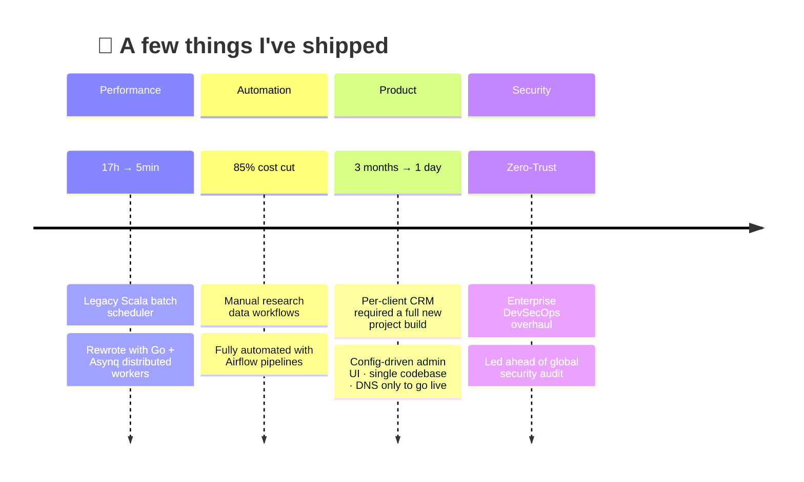

I'm an **AI-Native Full-Stack Engineer** with 10 years of experience across healthcare, pharma, and insurance domains.  
I design agentic systems where LLMs don't just generate text — they call tools, orchestrate workflows, and drive real outcomes.  
Architecture decisions show up directly in business metrics.

Currently working as a Tech Lead at a global healthcare data company,  
leading data pipeline infrastructure and AI platform engineering.

---

### What I do

🤖 **AI-Native & Coding Agent** — Function calling pipelines, tool-use LLM orchestration, autonomous coding agents with LangGraph  
🧠 **Agent Orchestration** — Multi-agent task decomposition, skill-based workflows, RAG + NL-to-SQL inference serving  
⚡ **High-Performance Backend** — Go (Fiber + Asynq) distributed systems, async worker auto-scaling  
☁️ **Cloud-Native Infra** — Kubernetes, Terraform, Azure/GCP, Zero-Trust DevSecOps

---

---

### Full Stack

**AI/LLM**  

**Backend**  

**Frontend**  

**Data**  

**Infra**  

